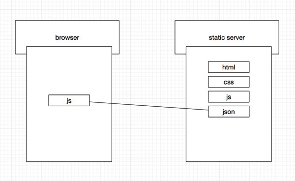

# blodely.github.io

### Intro

个人简历页;

Powered by Github pages;

由 HTML5, CSS, JavaScript, Semantic UI 等手写而成.

### 流水账

平时会常常这弄弄那弄弄, 工作之余的一点和技术沾边的事, 就做一个流水账一样的记录吧.

放在这里→ [other things](http://cv.luoyu.space/other-things.html)

### 灵感

_Thursday, April 19, 2018_

编写这个的过程中, 因为有些列表(比如公司列表, 项目列表), 所以想不要写死, 用数据源来生成页面, 会稍微优雅点.

然后思考用什么方式存储和读取数据(因为是个静态服务器), 最后落到了JSON数据文件的形式上.

使用JSON数据文件, 整个操作就会看起来很正常的形式:

JSON数据放在服务器, 浏览器端的js使用ajax读取服务器上的数据, 继而生成对应的列表.

然后就想到如果是 _数据文件_ , 那其实也就是一种轻量的文档数据.

那是不是可以想办法去优雅的操控这块数据呢, 是否可以将数据规划的更有组织性呢? 如同一个文档数据库.

来尝试实现一个简单的产品.

### Author

[Luo Yu](http://luoyu.space)

Email: [indie.luo@gmail.com](mailto:indie.luo@gmail.com)
